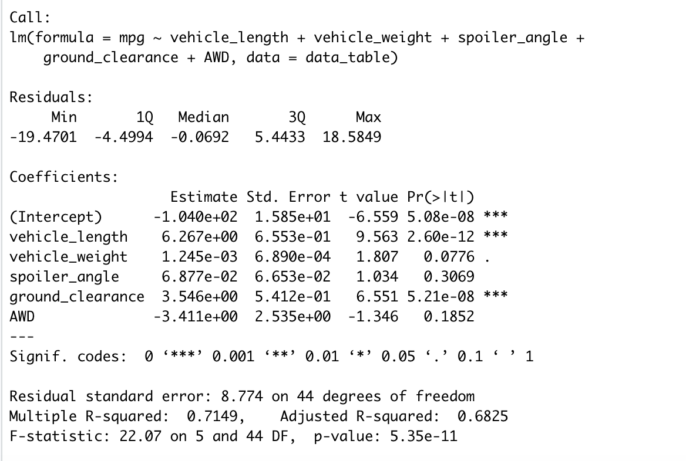
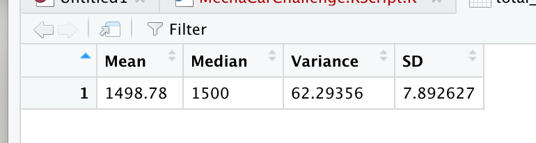
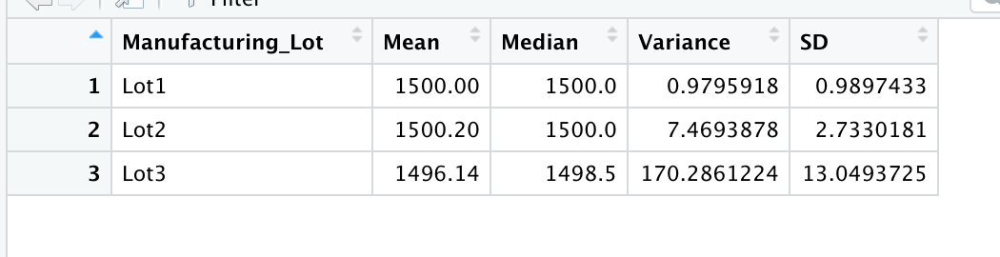
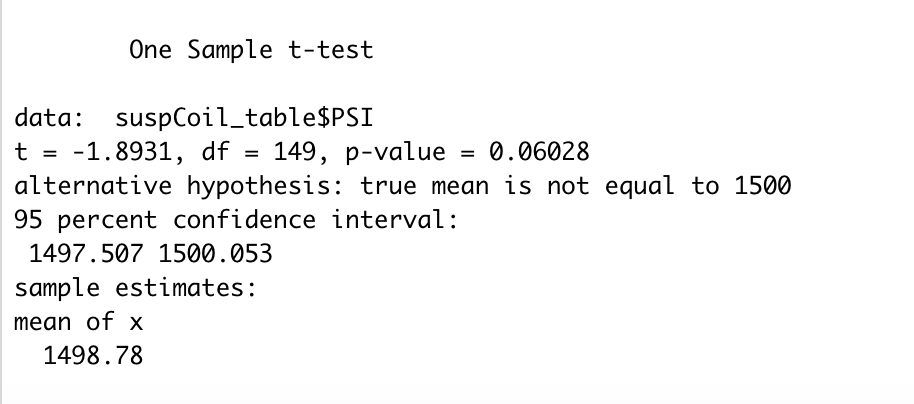
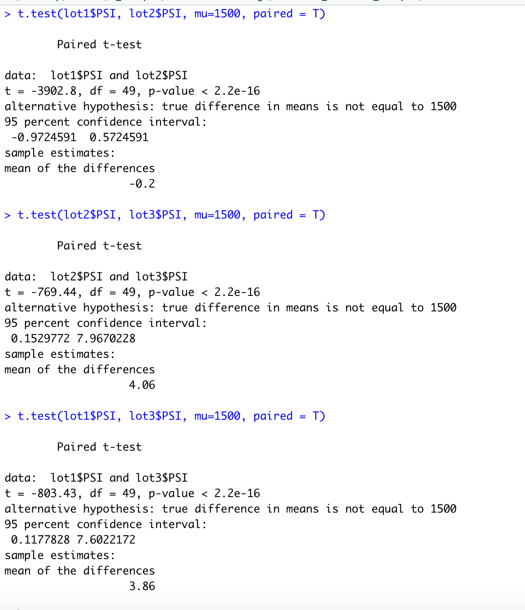

# MechaCar Statistical Analysis

## Linear Regression to Predict MPG

### Linear Regression

### Linear Regression Summary

Summary: The linear regression line was derived from dataset that contains mpg test results for 50 prototype MechaCars. The MechaCar prototypes were produced using multiple design specifications to identify ideal vehicle performance. Multiple metrics, such as vehicle length, vehicle weight, spoiler angle, drivetrain, and ground clearance, were collected for each vehicle. I designed a linear model that predicts the mpg of MechaCar prototypes using several variables.

Which variables/coefficients provided a non-random amount of variance to the mpg values in the dataset? (highest T-value not the intercept)
The variable/coefficients provided a non-random amount of variance to the mpg values was the vehicle length. This was determined by the T-value of 9.563 which was highest compared to the other 5 variables. 

Is the slope of the linear model considered to be zero? Why or why not? (which one is closer to 0 y- int)
From variables, the vehicle weight is considered to have a slope to be zero because the y-intercept is closest to zero. This is not true for the other variables. 

Does this linear model predict mpg of MechaCar prototypes effectively? Why or why not? (look at R squared) 
The linear model gives us a close prediction of mpg of MechaCar prototypes because the R squared is 0.7149 shows a close positive correlation, but it is not 100%

## Summary Statistics on Suspension Coils

### Suspension Coils Summary

### Suspension Coils Summary per Lot

Summary: The statistics data table was derived from dataset that contains the results from multiple production lots. In this dataset, the weight capacities of multiple suspension coils were tested to determine if the manufacturing process is consistent across production lots. I created a summary statistics table to show the following. The suspension coil’s PSI continuous variable across all manufacturing lots. As well as the following PSI metrics for each lot: mean, median, variance, and standard deviation.

The design specifications for the MechaCar suspension coils dictate that the variance of the suspension coils must not exceed 100 pounds per square inch. Does the current manufacturing data meet this design specification for all manufacturing lots in total and each lot individually? Why or why not?
The current manufacturing data does not meet this design specification for all manufacturing lots in total and as well as each lot individually because it has exeeded th 100 pounds per square inch. The average psi is 1400 in total and per lot the average psi is 1500.

## T-Tests on Suspension Coils
 
### T-Test 

### T-Test Subset

Based from our analysis the T-Test shows a p-value of 0.06 means that there is a probability of 6% of obtaining that result by chance when the treatment has no real effect. Because we set the significance level at 5%, the null hypothesis should not be rejected. Overall result is that manufacturing lots and each lot individually are statistically not different from the population mean of 1,500 pounds per square inch. But compared to the t-test per lots there is a signaficance, manufacturing lots and each lot individually are statistically different from the population mean of 1,500 pounds per square inch. The p-values range around less than 2.2e-16 which will reject the null hypothesis.

## Study Design: MechaCar vs Competition
The statistical study that is described below can quantify how the MechaCar performs against the competition in regards to size of the car and their fuel efficiency. Testing dependent variable will be the size of the car and the gas tank and the independent variables will be miles per gallon (mpg) and miles per hour (mph). This test will show whether size of the car will determine the fuel efficiency.

What metric or metrics are you going to test?
The metric I will be testing will be miles per hour (mph), miles per gallon, and how big the gas tank is per car.

What is the null hypothesis or alternative hypothesis.
Hypothesis: Does driving in highways will have a more efficent mph.
Null Hypothesis: Driving large tank cars in highways will have less efficent mph.
Alertnative Hypothesis: Driving large tank cars in highways will have a more efficent mph.

What statistical test would you use to test the hypothesis? And why?
I would use statistical test and retrieve p-values this will show if we can accept the hypothesis and reject null and accpet alternative.

What data is needed to run the statistical test?
The data we would need would be the test of large, medium, and small cars (measures their gas tanks) driving the same distance in the highway and see the correlation between mph and mpg.
