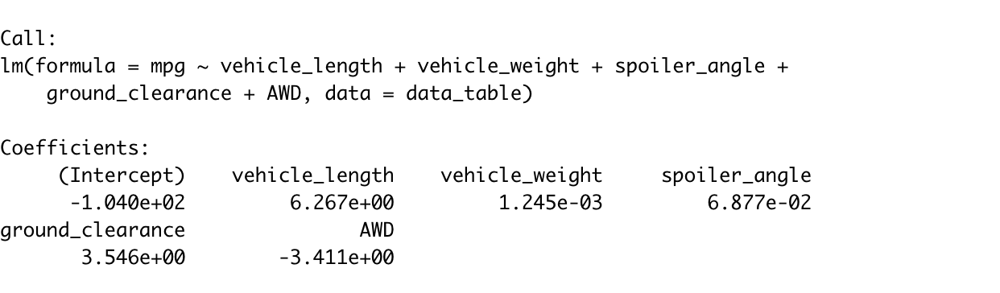

# MechaCar_Statistical_Analysis
## Linear Regression to Predict MPG

### Linear Regression

### Linear Regression Summary

Summary:

Which variables/coefficients provided a non-random amount of variance to the mpg values in the dataset? (highest T-value not the intercept)
The variable/coefficients provided a non-random amount of variance to the mpg values was the vehicle length. This was determined by the T-value of 9.563 which was highest compared to the other 5 variables. 

Is the slope of the linear model considered to be zero? Why or why not? (which one is closer to 0 y- int)
From variables, the vehicle weight is considered to have a slope to be zero because the y-intercept is closest to zero. This is not true for the other variables. 

Does this linear model predict mpg of MechaCar prototypes effectively? Why or why not? (look at R squared) 
The linear model gives us a close prediction of mpg of MechaCar prototypes because the R squared is 0.7149 shows a close positive correlation, but it is not 100%

## Summary Statistics on Suspension Coils

### Suspension Coils Summary

### Suspension Coils Summary per Lot

Summary:

The design specifications for the MechaCar suspension coils dictate that the variance of the suspension coils must not exceed 100 pounds per square inch. Does the current manufacturing data meet this design specification for all manufacturing lots in total and each lot individually? Why or why not?

## T-Tests on Suspension Coils

briefly summarize your interpretation and findings for the t-test results. Include screenshots of the t-test to support your summary

## Study Design: MechaCar vs Competition

Write a short description of a statistical study that can quantify how the MechaCar performs against the competition. In your study design, think critically about what metrics would be of interest to a consumer: for a few examples, cost, city or highway fuel efficiency, horse power, maintenance cost, or safety rating.
In your description, address the following questions:
What metric or metrics are you going to test?
What is the null hypothesis or alternative hypothesis?
What statistical test would you use to test the hypothesis? And why?
What data is needed to run the statistical test?
